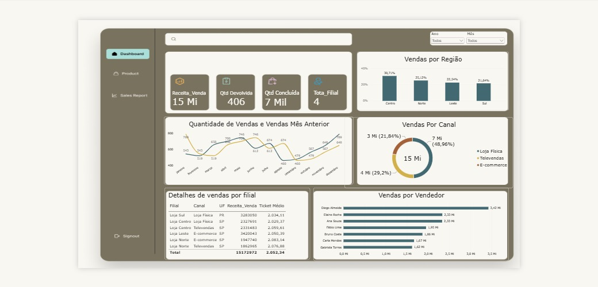

# Varejomax-sales-analysis
# 📊 Dashboard de Performance Comercial — VarejoMax
> **Case Study:** Análise de Vendas Multicanal e Multi-filial  
> **Ferramentas:** Power BI | DAX | Modelagem de Dados

---

## 📸 Visualização do Dashboard

VID-20260910-WA0161.gif
---

## 🎯 1. O Problema de Negócio
A **VarejoMax** é uma distribuidora com 4 filiais e 3 canais de venda (Loja Física, Televendas e E-commerce) atendidos por uma equipa de 7 vendedores. 

Devido ao rápido crescimento sem a devida profissionalização da análise de dados, a gestão comercial enfrentava uma falta de visibilidade clara sobre:
- Qual filial realmente liderava o faturamento;
- A performance individual de toda a força de vendas;
- A evolução do mix de canais ao longo do tempo.

O objetivo deste projeto foi transformar dados brutos em **respostas estratégicas e acionáveis** para apoiar a tomada de decisão.

---

## 🛠️ 2. Ferramentas e Abordagem
Antes de construir os visuais no Power BI, o projeto iniciou-se pela **mapeação das perguntas de negócio**:
1. **Modelagem de Dados:** Estruturação das tabelas de vendas por filial, canal, UF e vendedor.
2. **Criação de Medidas em DAX:** Desenvolvimento de KPIs estratégicos (*Receita Venda*, *Qtd Devolvida*, *Qtd Concluída*, *Total Filial*, *Ticket Médio* e *Participação Percentual*).
3. **Construção de Dashboard Visual:** Design intuitivo com menu lateral, KPIs de topo, gráfico de série temporal com comparação do mês anterior, distribuição regional, doughnut chart por canal, detalhamento em tabela e ranking completo de vendedores.

---

## 🔍 3. Principais Descobertas (Insights)

* **Desempenho por Filial:** A *Loja Centro* lidera o faturamento com **30,71%** da receita total, seguida pela *Norte* (25,12%), *Leste* (22,54%) e *Sul* (21,64%). A receita global atingiu **R$ 15 Mi** (R$ 15.172.972 no detalhe).
* **Performance da Força de Vendas:**
  - **Diogo Almeida** é o líder isolado de vendas, gerando **R$ 3,42 Mi**.
  - **Elaine Rocha** e **Ana Souza** aparecem empatadas na segunda posição com **R$ 2,33 Mi** cada.
  - A amplitude de vendas varia de R$ 3,42 Mi (líder) a R$ 1,02 Mi (Gabriela Torres), revelando a necessidade de nivelamento da equipa.
* **Canais de Distribuição:** A *Loja Física* ainda é o canal dominante (**48,96%** / R$ 7 Mi), seguida pelo *E-commerce* (**29,2%** / R$ 4 Mi) e *Televendas* (**21,84%** / R$ 3 Mi).
* **Mudança Estrutural no Mix de Canais (2024–2026):**
  - **E-commerce:** Quase dobrou a sua participação no mix de vendas, saltando de **15,59% para 30,60%** (+15,01 p.p.).
  - **Loja Física:** Sofreu um declínio contínuo, caindo de **54,59% para 44,12%** (-10,47 p.p.).
  - **Televendas:** Reduziu a representatividade de **29,83% para 25,81%** (-4,02 p.p.).

---

## ⚠️ 4. Limitações Identificadas na Base de Dados
Uma entrega analítica de elevado valor exige identificar as fronteiras dos dados e o que o painel **ainda não consegue responder**:

1. **Ausência de Causabilidade (Porquê da Queda nos Canais Tradicionais):** O dashboard diagnostica *o que* está a acontecer (queda da Loja Física e Televendas em prol do E-commerce), mas a base atual não possui dados qualitativos ou comportamentais que expliquem *o porquê* (ex: se é uma migração saudável de canal ou perda real de clientes por atrito no atendimento presencial).
2. **Granularidade Temporal Desagregada:** O gráfico de evolução mensal apresenta a quantidade agregada, não permitindo isolar a sazonalidade específica de cada canal ou filial separadamente.
3. **Métricas Faltantes por Vendedor:** O Ticket Médio está disponível ao nível de Filial/Canal (média geral de R$ 2.052,34), mas ainda não está individualizado por vendedor.

---

## 💡 5. Recomendações Estratégicas & Próximos Passos

### 🚀 Recomendação de Negócio (Curto Prazo):
- **Acelerar Investimentos no E-commerce:** Direcionar orçamento de marketing e infraestrutura para o e-commerce, o único canal com tendência de crescimento consistente (+15,01 p.p.).
- **Plano de Capacitação de Vendas:** Utilizar a visibilidade total do ranking para criar programas de *mentoring* interno, aproximando a performance dos vendedores da base (ex: Gabriela Torres e Carla Mendes) dos resultados dos *top performers*.

### 🔬 Plano de Investigação de Dados (Análise Diagnóstica):
Para responder às causas da perda de tração da Loja Física e Televendas, propõe-se o enriquecimento do modelo de dados com:
- **Cruzamento de ID do Cliente (Omnicanalidade):** Mapear se os clientes tradicionais estão a migrar para o digital ou se a loja física está a sofrer *churn* (abandono).
- 
- **Dados Qualitativos (NPS e Atendimento):** Integrar pesquisas de satisfação e motivos de desistência na loja física/televendas.
- **Análise de Preço e Stock:** Verificar se disparidades de preço, promoções exclusivas do site ou falta de stock presencial estão a forçar a migração de canal.
---

